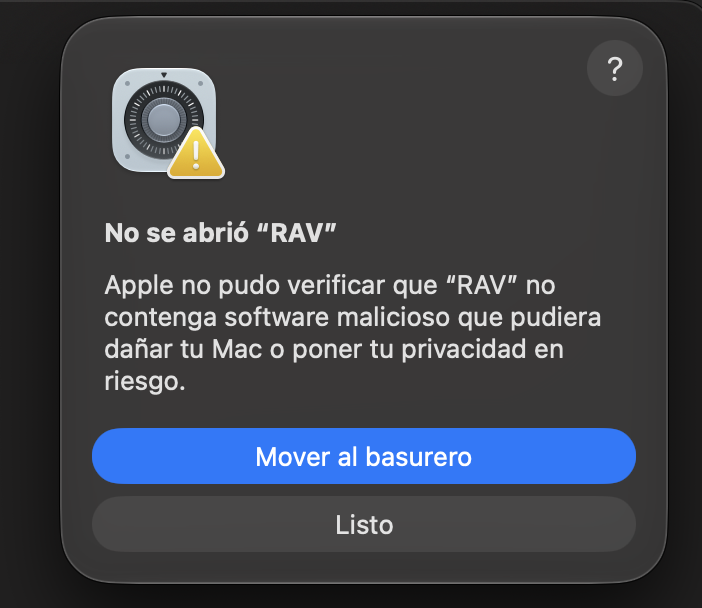

# RAV | Referee Analytics & Video

Descargá la última versión de RAV para tu computadora. Para usarla
necesitás una cuenta habilitada: si no tenés, pedísela al administrador.

> [!IMPORTANT]
> **¿Tenés Mac?** La primera vez que abras RAV, macOS te va a mostrar el
> aviso **"No se abrió RAV"**. Es normal (RAV no viene de la App Store) y
> se resuelve en 1 minuto. Los pasos están más abajo:
> **[👉 Si en Mac dice "No se abrió RAV"](#si-en-mac-dice-no-se-abrió-rav)**.

## 1. Descargá el instalador

| Tu computadora | Descarga |
|---|---|
| **Mac con chip Apple** (M1, M2, M3, M4, M5…) | [⬇ RAV-mac-apple-silicon.dmg](https://github.com/valeferrero4/RAV-descargas/releases/latest/download/RAV-mac-apple-silicon.dmg) |
| **Mac con procesador Intel** | [⬇ RAV-mac-intel.dmg](https://github.com/valeferrero4/RAV-descargas/releases/latest/download/RAV-mac-intel.dmg) |
| **Windows** (10 u 11) | [⬇ RAV-windows-setup.exe](https://github.com/valeferrero4/RAV-descargas/releases/latest/download/RAV-windows-setup.exe) |

**¿Qué Mac tengo?** Tocá el menú  (arriba a la izquierda) →
**Acerca de esta Mac**. Si dice **Chip Apple M…**, es la primera opción;
si dice **Procesador Intel…**, la segunda.

No hace falta instalar nada más: RAV ya trae adentro todo lo que
necesita para mostrar los videos.

## 2. Instalá RAV

### En Mac

1. Abrí el archivo `.dmg` que descargaste.
2. Arrastrá **RAV** a la carpeta **Aplicaciones**.
3. Abrí RAV desde **Aplicaciones**.
4. La primera vez va a aparecer el aviso **"No se abrió RAV"**: seguí los
   pasos de abajo. 👇

### Si en Mac dice "No se abrió RAV"

Así se ve el aviso:



**Es normal y se hace una sola vez.** Seguí estos pasos en orden:

1. Tocá **Listo**.
   ⚠️ **No toques "Mover al basurero"** (si lo hiciste, volvé a instalar RAV).
2. Abrí **Ajustes del Sistema**: menú  (arriba a la izquierda) →
   **Ajustes del Sistema**.
3. En la columna de la izquierda, entrá a **Privacidad y seguridad**.
4. Bajá hasta el final de la página. Vas a ver el texto
   *"Se bloqueó el uso de "RAV" porque no es de un desarrollador identificado"*
   y al lado el botón **Abrir igualmente**. Tocalo.
5. macOS te pide tu **contraseña de la Mac** (o tu huella): ponela.
6. Si aparece otro aviso, tocá **Abrir igualmente** de nuevo.

✅ **Listo: RAV se abre y desde ahora abre normal**, como cualquier app.

> [!TIP]
> **¿No aparece el botón "Abrir igualmente"?** macOS lo muestra solo
> durante un rato después de intentar abrir RAV. Volvé a abrir RAV desde
> **Aplicaciones**, tocá **Listo** y entrá enseguida a **Privacidad y
> seguridad**.

<details>
<summary><b>Si en cambio dice que RAV "está dañada"</b> (solución con Terminal)</summary>

1. Abrí la app **Terminal**: apretá **Cmd + Espacio**, escribí `Terminal` y
   apretá Enter.
2. Copiá esta línea, pegala en la Terminal y apretá **Enter**:

   ```
   xattr -dr com.apple.quarantine /Applications/RAV.app
   ```

   (No muestra nada: es normal.)
3. Cerrá la Terminal y abrí RAV normalmente.

</details>

Al instalar una **versión nueva** de RAV, macOS puede volver a pedírtelo:
se resuelve con los mismos pasos.

### En Windows

1. Hacé doble click en `RAV-windows-setup.exe`.
2. Puede aparecer una pantalla azul **"Windows protegió su PC"**. Es
   normal (RAV no viene de la Microsoft Store):
   1. Tocá el texto chico **Más información**.
   2. Aparece el botón **Ejecutar de todas formas**: tocalo.
3. Seguí los pasos del instalador. RAV queda en el menú Inicio y, si lo
   elegís, en el Escritorio.

## 3. Ingresá con tu cuenta

La primera vez que abrís RAV te pide el **email y la contraseña** que te
dio el administrador. Después entra solo.

- Sin internet podés seguir usándolo hasta **7 días**.
- Cada cuenta se puede usar en hasta **2 computadoras**.
- **¿Cambiás de computadora?** En la que dejás de usar, abrí RAV y tocá
  **Cerrar sesión** (arriba a la derecha, en el Inicio): esa computadora
  deja de ocupar un lugar y podés entrar desde la nueva.

## ¿Problemas?

| Te aparece… | Qué hacer |
|---|---|
| **Mac:** "No se abrió RAV" | Seguí [estos pasos](#si-en-mac-dice-no-se-abrió-rav). |
| **Mac:** "RAV está dañada" | Usá la [solución con Terminal](#si-en-mac-dice-no-se-abrió-rav) (desplegá *"Si en cambio dice que RAV está dañada"*). |
| **Windows:** "Windows protegió su PC" | Tocá **Más información** → **Ejecutar de todas formas**. |
| "RAV necesita VLC" o "RAV no pudo iniciar VLC" | Descargá de nuevo el instalador (paso 1) e instalá RAV otra vez. Si sigue, instalá VLC desde [videolan.org](https://www.videolan.org/vlc/) (en Windows, el de **64 bits**; en Mac, el de tu tipo de Mac). |
| "Email o contraseña incorrectos" | Revisá que estén bien escritos (sin espacios). Si no, pedile los datos al administrador. |
| "Tu cuenta no está habilitada" o "Tu suscripción venció" | Escribile al administrador. |
| "Ya está activada en 2 computadoras" | En una de las que ya no uses, abrí RAV y tocá **Cerrar sesión**. Si no la tenés más, pedile al administrador que la libere. |
| "Hace más de 7 días que RAV no puede verificar tu cuenta" | Conectate a internet y abrí RAV de nuevo. |

## Actualizar

Descargá de nuevo el instalador de esta página e instalalo encima (en Mac,
reemplazá la app en Aplicaciones). **Tus proyectos y paneles no se borran.**

## Versiones anteriores

Todas las versiones están en [Releases](https://github.com/valeferrero4/RAV-descargas/releases).
